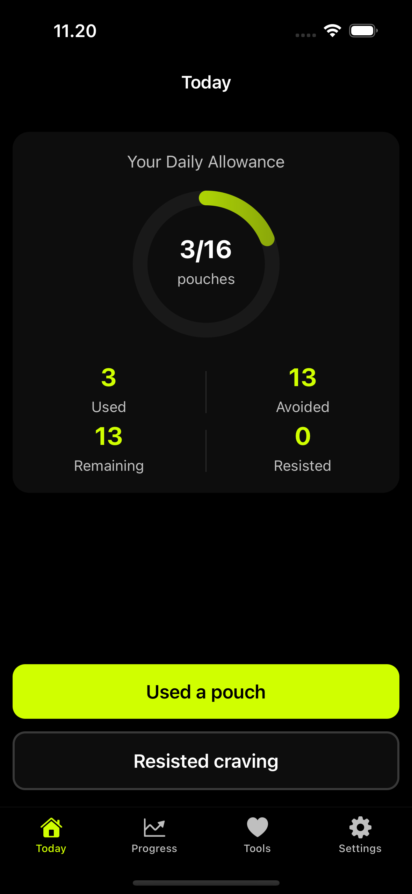
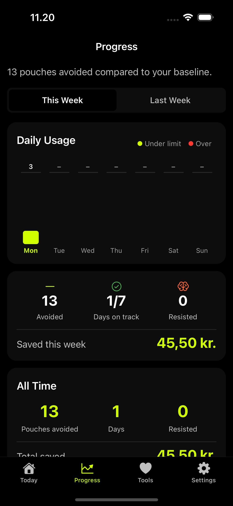
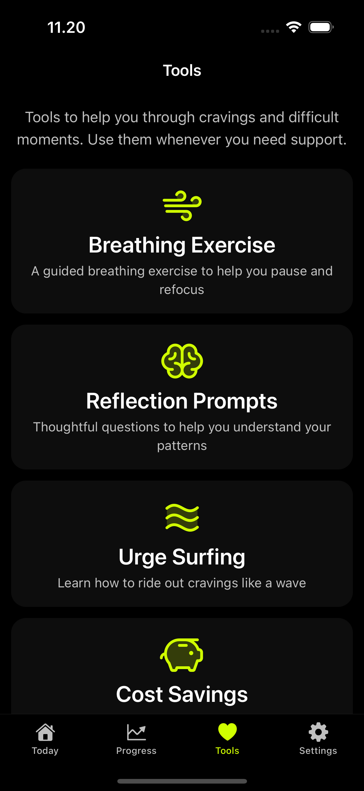
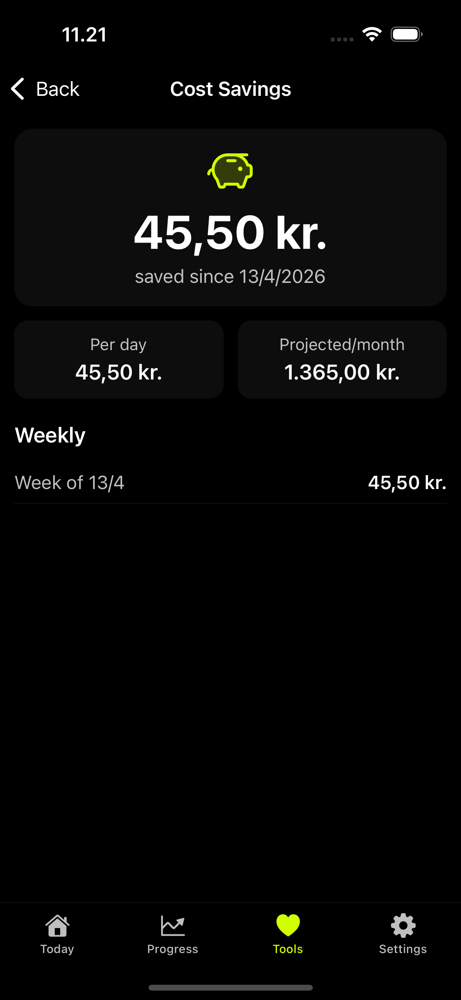

# Wean Nicotine

[](https://github.com/JarlLyng/wean-nicotine/actions/workflows/ci.yml)
[](./LICENSE)
[](./CHANGELOG.md)
[](https://apps.apple.com/app/wean-nicotine/id6745262907)
[](https://docs.expo.dev/)
[](https://madebyhuman.iamjarl.com)

**Wean Nicotine** is a mobile app that helps people gradually reduce and eventually stop using snus (nicotine pouches) through a calm, supportive, and non‑judgmental approach.

Instead of quitting cold turkey, Wean focuses on **tapering** — reducing usage step by step, at your own pace.

<p align="center">
  
  
  
  
</p>

## Documentation

If you need to understand the repository quickly:

- Start with [`docs/README.md`](./docs/README.md) for the documentation map.
- Read [`docs/AI_CONTEXT.md`](./docs/AI_CONTEXT.md) for the canonical architecture and domain summary.
- Use code as source of truth for exact behavior.

---

## ✨ Core idea

Quitting snus doesn’t have to be all or nothing.

Wean helps users:
- set a realistic baseline
- follow a gradual reduction plan
- track progress without shame
- recover quickly from slip‑ups
- stay motivated through time, money, and habit insights

---

## 🎯 Target audience

- Daily snus / nicotine pouch users
- People who want to **reduce first**, not quit abruptly
- Users who prefer a calm, minimalist, and private experience

---

## 🧠 Product principles

- **Wean, don't punish**  
- **Progress over perfection**  
- **No shame, no streak anxiety**  
- **Offline‑first & private by default**  
- **Simple enough to use in 2 seconds**

---

## 📱 Feature set

### Onboarding
- Set baseline usage (pouches per day)
- Optional price per can (for savings tracking)
- Select common triggers (stress, coffee, after meals, etc.)

### Daily tracking
- One‑tap log: *Used a pouch*
- One‑tap log: *Craving resisted*
- Daily allowance based on taper plan
- Calm, non-judgmental UI even if you go over the limit

### Taper plan
- Automatic weekly reduction with user-selectable pace (3% to 15%)
- Edit baseline, pace, or price anytime from Settings without losing log history
- Undo accidental logs within a 5-second window

### Progress & motivation
- Pouches avoided vs baseline
- Money saved
- Small, supportive milestones (not aggressive streaks)

### Support tools
- Short breathing exercises
- Urge‑surfing guidance
- Simple reflection prompts

### Notifications (optional)
- Daily check‑in
- Trigger‑based reminders
- Gentle encouragement — never guilt

---

## 🏗️ Tech stack

- **Expo** (React Native)
- **Expo Router** (file‑based navigation)
- **Local‑first storage** (SQLite via `expo-sqlite`)
- **Expo Notifications**
- **Sentry** (error tracking & monitoring)
- No backend — by design

**Note:** This app is designed for mobile (iOS/Android) only. SQLite is not available on web browsers.
Initial release focus is **iPhone**.

**New Architecture:** This app runs on React Native's New Architecture by default in Expo SDK 55, which is required by `react-native-reanimated` 4.x.


## 🔗 Links

- **Marketing site**: `https://weannicotine.iamjarl.com/`
- **Privacy policy**: `https://weannicotine.iamjarl.com/privacy/`

---

## 📂 Project structure

```
app/
  (onboarding)/          # Onboarding flow screens
    welcome.tsx
    baseline.tsx
    pace.tsx
    price.tsx
    triggers.tsx
  (tabs)/                # Main app screens (tab navigation)
    home.tsx             # Today / Daily allowance screen
    progress.tsx         # Progress tracking screen
    tools/               # Support tools
      breathing.tsx
      urge-surfing.tsx
      reflection.tsx
      reflection-journal.tsx
      cost-savings.tsx
    settings/            # Settings screens
      index.tsx
      edit-plan.tsx
      notifications.tsx
      reset-taper.tsx
components/             # Reusable UI components (incl. ui/ primitives)
hooks/                  # React hooks (useHomeData, useAppInitialize, …)
lib/                    # Business logic & utilities
  db*.ts                # Database operations
  design.ts             # IAMJARL design tokens
  theme.ts              # Theme bridge for design tokens
  taper-plan.ts         # Tapering math
  progress.ts           # Progress + milestones
  notifications.ts      # Local notification scheduling
docs/                   # Documentation
website/                # Astro marketing site
```

See [`docs/README.md`](./docs/README.md) for the documentation index and [`docs/decisions/storage.md`](./docs/decisions/storage.md) for storage architecture details.

---

## 🚫 Out of scope

- Accounts / login
- Cloud sync
- Community features
- Medical advice
- AI personalization

---

## 🌍 Internationalization

- App language: English (initially)
- Neutral, inclusive tone
- Designed for international App Store distribution

---

## 🚀 Getting started (dev)

Install dependencies:

```bash
npm install
```

Start the app:

```bash
npx expo start
```

### Environment Variables

#### Development (local)
Copy `.env.example` to `.env` and fill in the values. Relevant for Sentry:

- **EXPO_PUBLIC_SENTRY_DSN** — DSN from Sentry (Client Keys). Used by the app to send errors.
- **SENTRY_AUTH_TOKEN** — (optional) Auth token from Sentry (User settings → Auth Tokens). Used by the Sentry CLI for tasks like source-map upload so stack traces render readably in Sentry.

Sentry events are **not** sent in development mode — they are only logged to the console.

#### Production (EAS Build — local or cloud)
With `eas build` (both `--local` and cloud), **EAS Secrets** are used — not `.env`. Create the secret before building:

```bash
eas env:create --name EXPO_PUBLIC_SENTRY_DSN --value "https://your-dsn@xxx.ingest.sentry.io/xxx" --environment production --visibility plaintext
```

Local `.env` is for dev and other tooling; EAS only injects variables from EAS Secrets during builds.

**Note:** Sentry is optional. The app works without it, but errors won't be tracked in production. Configuration and verification: **`docs/SENTRY.md`**. The DSN is embedded at build time via `app.config.js` → `extra.sentryDsn`.

### Testing Notifications

Notifications require a development build and do not work in Expo Go. To test notifications:

**iOS:**
```bash
npx expo run:ios
```

**Android:**
```bash
npx expo run:android
```

---

## 📦 Build & release (iOS)

**Preferred workflow:** Local build → IPA → upload via **Transporter** to App Store Connect.

- **Bundle ID:** `com.iamjarl.taper`
- **Local build (IPA) — Expo from terminal:**
  1. **Build number:** In `app.config.js`, `ios.buildNumber` must be higher than the last build uploaded to App Store Connect. `version` is user-visible (currently `1.3.1`) and only bumped for an actual app update.
  2. **Sentry:** Create the EAS Secret so the DSN is embedded in the build:
     `eas env:create --name EXPO_PUBLIC_SENTRY_DSN --value "https://your-dsn@xxx.ingest.sentry.io/xxx" --environment production --visibility plaintext`
  3. From the project root:
     ```bash
     npx eas build --profile production --platform ios --local
     ```
     The build runs on your Mac and produces an IPA (EAS prints the path when finished).
  4. Upload the IPA to App Store Connect via **Transporter** (Mac App Store).

- **Xcode only (if you have `ios/` and prefer it):** Open `ios/Taper.xcworkspace` → **Product → Archive** → **Distribute App** / **Export** → IPA → **Transporter**. Make sure the build number in Xcode/Info.plist matches or exceeds the last uploaded build.

- **Sentry:** DSN comes from EAS env (production). For local builds: `export EXPO_PUBLIC_SENTRY_DSN="https://..."` in the terminal before `eas build --local`. Troubleshooting: `docs/SENTRY.md`.

**Alternative (cloud build):** `npx eas build --profile production --platform ios` (without `--local`) — builds in the cloud. Same EAS Secret. Then either `npx eas submit --platform ios --latest`, or download the IPA and use Transporter.

No secrets or credentials are stored in the repo. Use EAS Secrets for `EXPO_PUBLIC_SENTRY_DSN` (and any others) during builds.

---

## 🗺️ Roadmap

All planned work is tracked in [GitHub Issues](https://github.com/JarlLyng/wean-nicotine/issues) with priority labels (P1/P2/P3) and category labels (seo, aso, website, marketing, enhancement).

See [`CHANGELOG.md`](./CHANGELOG.md) for the version history.

---

## 📄 License

[MIT](./LICENSE) © 2026 IAMJARL.

---

Built with care under the **IAMJARL** project.

